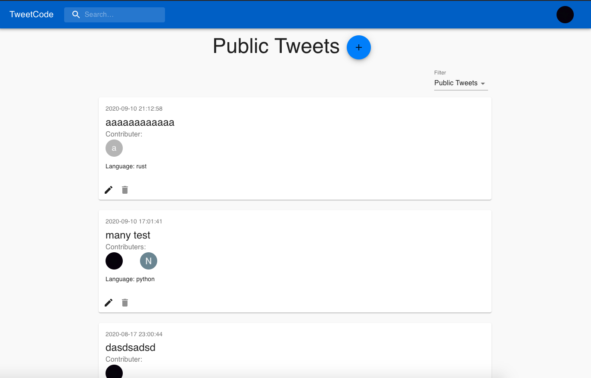
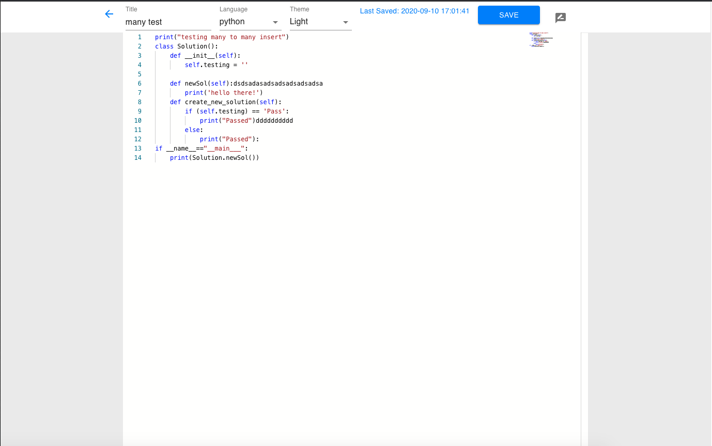

# TweetCode
Using Node.js, Express, and React to create a fast sharing, collaborative code writing enviroment.







### Development:
You can run on your local machine by using docker or through standard npm.
- start up a postgres server and create a database.
- cd into web, server, and auth directories and you can build the respective images and run ```docker run -p <PORT:PORT>```
- you can also just cd into the directories and start the local servers by running npm start for each directory.